_注：本文举例的说明书PDF为官方说明书扫描PDF的页码，非原文件的页码。_
_附：_

contax_tix说明书.pdf

## 必要配件

### 电池

CONTAX TIX使用3V的CR2电池，推荐使用松下爱乐普的，实测新电池为3.2V。
_*尽量不要使用充电电池，本人买过一个CR123A充电电池，充满后3.99V_😅

### 胶卷

使用APS胶卷，一般现在能收到的就富士和柯达的那几个过期卷
复装非电影卷：金200、全能400，可以过片
复装电影卷：已知5294，可以过片

## 外观介绍

### 正面

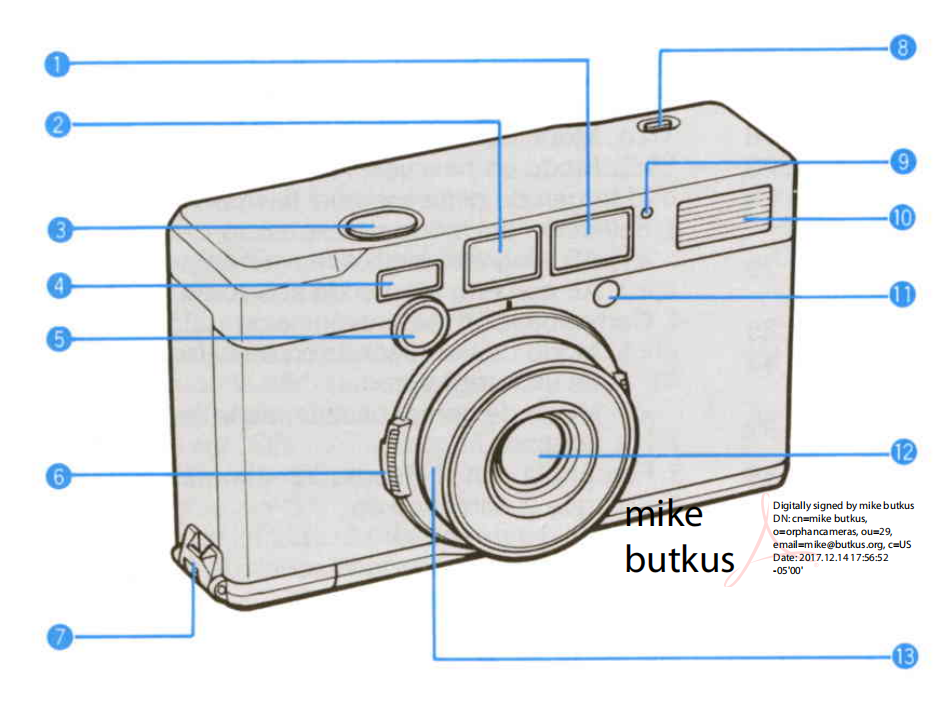

1. 取景器
2. 取景器照明辅助窗口（遮上的话，框线会看不清）
3. 快门按钮
4. 自动对焦取景窗
5. 自动对焦取景辅助灯
6. 光圈环
7. 手绳槽
8. 自拍按钮
9. 自拍提示灯
10. 闪光灯
11. 测光传感器
12. 镜头
13. 遮光罩（可以扭下来反扣回去，参照下图。有些机器会比较紧，涂一点小苏打就行。实在拧不下来就算了，功能性聊胜于无）

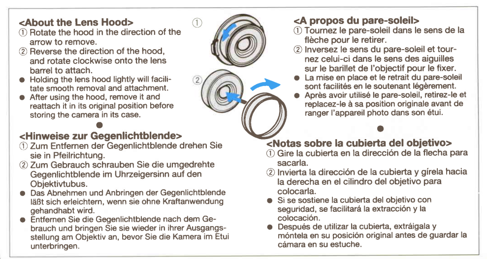

### 背面

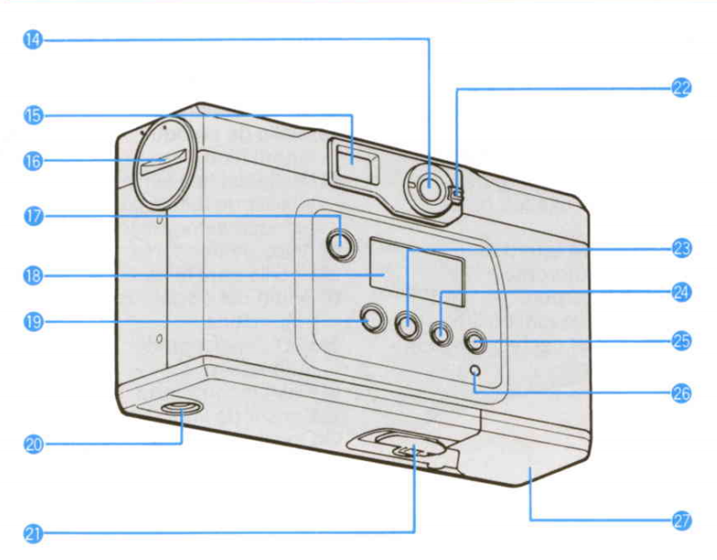

14. 开关机按钮
15. 取景器
16. 电池仓
17. 闪光灯按钮
18. 屏幕
19. 曝光补偿按钮
20. 1/4螺纹孔
21. 胶卷仓锁紧旋钮
22. 画幅切换旋钮
23. 数据模式按钮
24. 选择选择按钮
25. 数据设置按钮
26. 设置恢复孔（用牙签顶一下）

### 背面屏幕功能

1. 闪光灯模式
2. 曝光数据记录
3. 标题记录
4. 单点对焦模式
5. 快门速度、拍摄张数、日期、标题语言及序号
6. 日期格式
7. 低电量
8. 是否上卷

参照扫描说明书PDF的第9页。

### 取景器功能

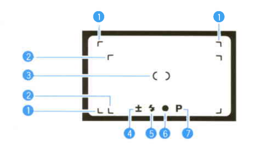

1、2：框线
3：对焦点
4：曝光补偿（**只有取景器里亮了，才启用了曝光补偿**，背面默认+1.5）
5：闪光灯
6：是否合焦
7：自动挡

## 功能设置

### 装入胶卷后显示的信息

关机后，按闪光灯按钮切换显示胶卷信息

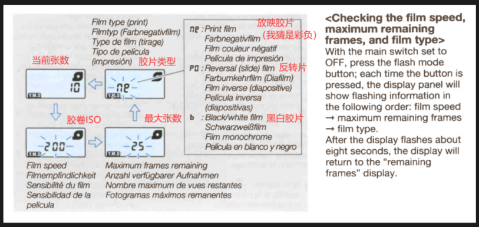

### 三种画幅设置

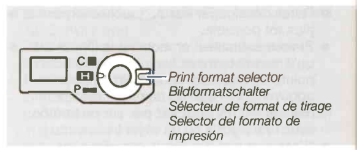

1. APS-H，16比9原生画幅
2. APS-C，3比2左右遮挡画幅
3. APS-P，3比1，上下遮挡画幅

拨动旋钮可以切换画幅，画幅变化取景器内框线也会变化。
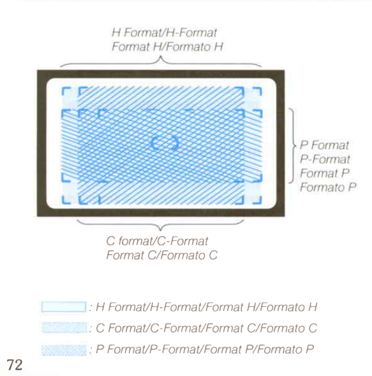

### 自动挡和光圈优先A挡

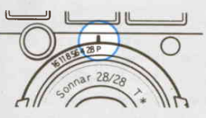

旋转镜头外圈的光圈环：

1. P为自动挡
2. 其他数字为光圈优先A挡

### 三种拍摄模式

1. 普通模式：关机状态下，直接按开机键开机。
2. 风景模式：调整闪光灯至【】，此时会禁用闪光灯，焦距会调整至无限远，此时手遮挡住相机依然可以按下快门。参照扫描说明书PDF的第38页。
3. 单点对焦模式 ：关机状态下，按住开机键开机，直至相机背面屏幕左侧显示【】。如下图，参照扫描说明书PDF的第57页。

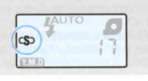

### 自拍功能

1. 按下顶部自拍按钮【正面按钮 8】。
2. 看见自拍提示灯闪烁【正面提示灯9】。
3. 按下快门。

### 闪光灯模式

#### 模式介绍

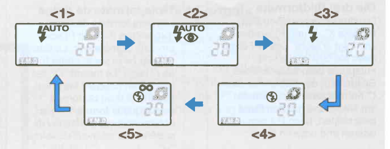

点按闪光灯模式按钮【背面按钮17】进行切换

1. 自动闪光
2. 防红眼自动闪光，会闪两下
3. 常闪
4. 关闭闪光灯
5. 风景模式

#### 如何永久改变闪光灯模式

长按闪光灯模式按钮【背面按钮17】，闪光灯指示会进入闪烁状态，等待几秒不闪烁后代表设置成功。

### 闪光灯距离指示

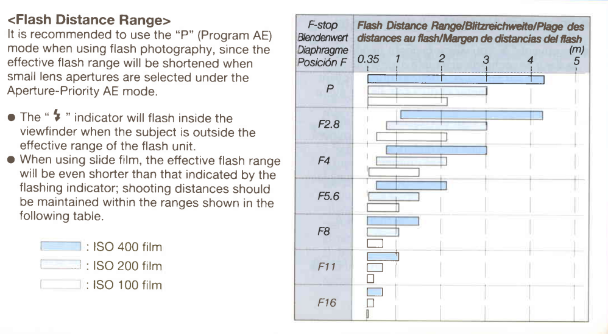

### 曝光补偿设置

按一下+/-按钮，屏幕显示+1.5闪烁，此时半按快门取景器会显示红色+-曝光补偿提示，代表下一张照片会以【+1.5EV】进行拍摄。
点按+/-按钮，进行曝光补偿切换，参照扫描说明书PDF的第48页。

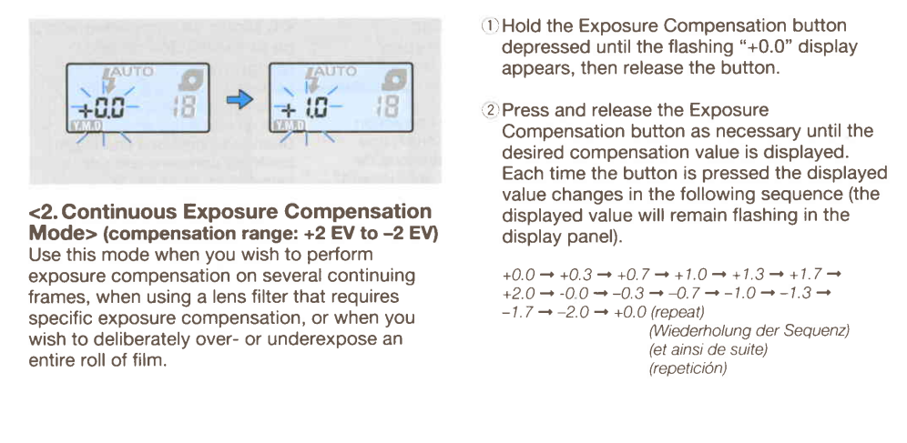

### 曝光锁定

在任意拍摄模式下，半按快门，取景器内显示【黄色●】，再调整对焦区域，可实现半按快门锁定曝光二次构图拍摄。参照扫描说明书PDF的第59页。

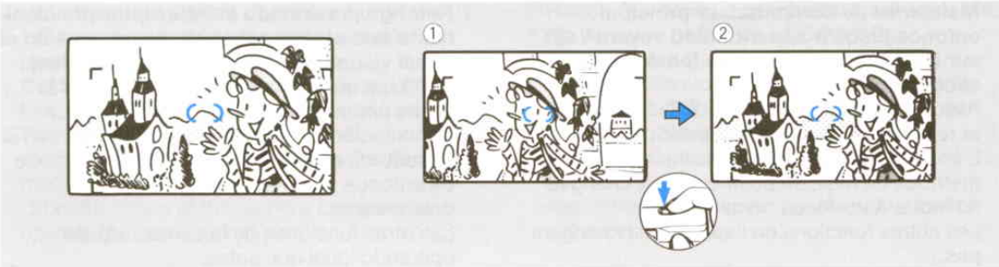

### 曝光参数、问候语、日期打印设置

#### 是否打印曝光参数

开机状态下，点按DATA按钮切换，直到屏幕左上角显示【EXP.】，代表打开曝光参数打印，不显示【EXP.】则代表关闭。

#### 是否打印问候语和日期

开启：开机状态下，点按DATA按钮，直到【TITLE】与下方数字闪烁，等待8秒不再闪烁，此时拍摄模式下会一直显示【TITLE】，代表已经开启。
关闭：操作同上，直到只剩下【TITLE】闪烁，再按一下DATA按钮，此时屏幕不再显示【TITLE】，代表已经关闭。
参照扫描说明书PDF的第62页。

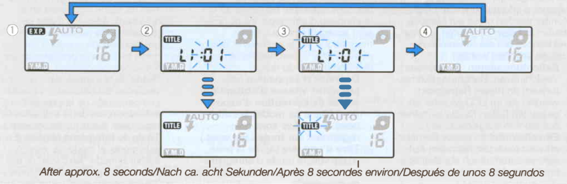

#### 问候语设置

开机状态下，点按DATA按钮，直到【TITLE】与下方数字闪烁，点按SELECT按钮切换 语言/问候语，点按SET按钮选中。
参照扫描说明书PDF的第66页。

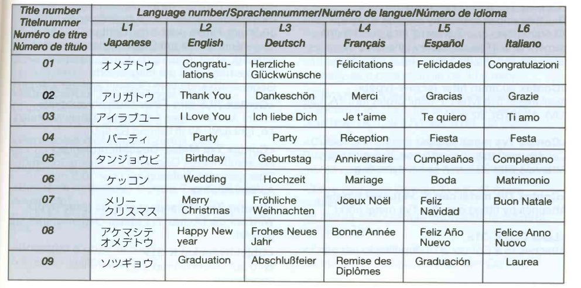

#### 日期设置

**关机状态下**，按DATA按钮切换日期格式，按SELECT按钮切换日期/时间设置，按SET按钮加时间
